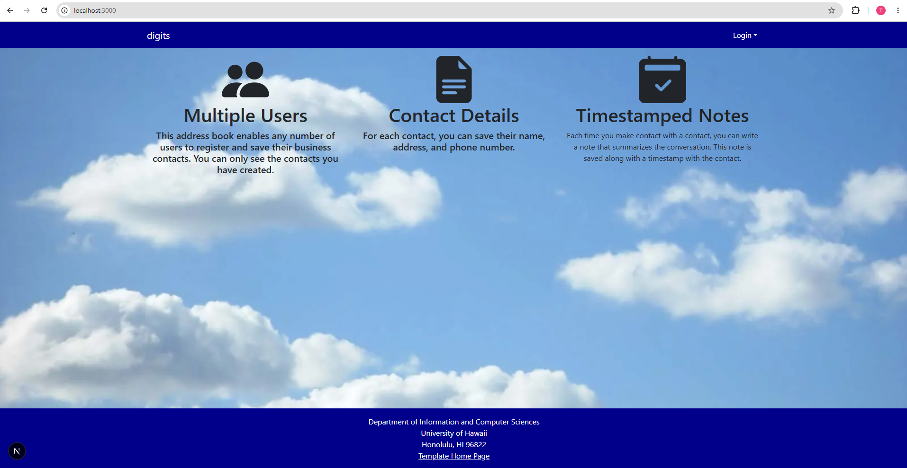

##digits application



Digits is an application that allows users to:
- Register an account
- Create and manage a set of contacts
- Add a set of timestamped notes regarding their interactions with each contact

##Installation
First, install packages
````
$ npm install
````
Create the database
````
$ createdb <digits-db-name>
````
Seed the database
````
$ npx prisma seed db
````
This is the output of adding to the database
````
Loaded Prisma config from prisma.config.ts.

Running seed command `tsx prisma/seed.ts` ...
Seeding the database
  Creating user: admin@foo.com with role: ADMIN
  Creating user: john@foo.com with role: USER
  Adding contact: Philip Johnson
  Adding contact: Henri Casanova
  Adding contact: Kim Binsted

The seed command has been executed.
````
To access the application run
````
$ npm run dev
````
This will allow you to access the app at http://localhost:3000

You can also run ESLint with
````
$ npm run lint
````

## User Interface Walkthrough
Landing Page
When you first bring up the application, you will see the landing pages that provides a brief introduction to the capabilities of Digits:


Register
If you do not have an account on the system, you can register by clicking on "Login", then "Sign Up":
